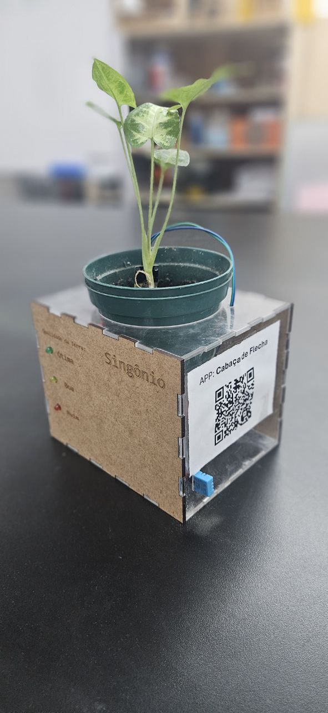
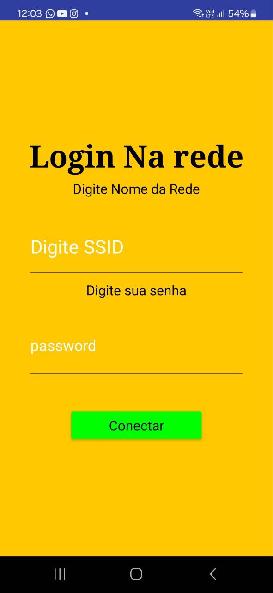

# Projeto Samambaia

O **Projeto Samambaia** é um sistema de monitoramento de plantas, atualmente sendo testado com a planta Singônio. O objetivo é fornecer informações em tempo real sobre as condições da planta, utilizando um aplicativo e sensores que monitoram a umidade do ar, temperatura e umidade do solo.

## Funcionalidades

- **Monitoramento em tempo real**: Através de sensores integrados, o sistema monitora a umidade do ar, temperatura ambiente e umidade do solo.
- **Conexão via ESP8266**: O hardware utiliza o microcontrolador ESP8266, permitindo que o sistema se conecte à rede Wi-Fi local, facilitando o acesso remoto aos dados da planta.
- **Aplicativo mobile**: O aplicativo desenvolvido na plataforma App Inventor permite que o usuário visualize as condições da planta de qualquer lugar do mundo, desde que o ESP8266 esteja conectado à internet.
- **Protótipo em fase de teste**: O projeto ainda está em fase de prototipagem, com testes sendo realizados para otimizar o design e a funcionalidade.

## Hardware

- **Microcontrolador ESP8266**: Responsável pela conectividade Wi-Fi e processamento dos dados dos sensores.
- **Sensores**:
  - Sensor de umidade do solo: Monitora os níveis de umidade da terra.
  - Sensor de umidade do ar: Mede a umidade ambiente.
  - Sensor de temperatura: Registra a temperatura ao redor da planta.
- **Caixa protótipo**: O hardware está alojado em uma caixa prototipada para testes, facilitando a montagem e ajustes necessários.

## Software

- **Código de configuração Wi-Fi**: O sistema permite que o usuário insira o nome da rede Wi-Fi e a senha diretamente no ESP8266, garantindo conectividade à internet e acesso aos dados de qualquer lugar.
- **Comunicação HTTP**: Uma vez conectado, o ESP8266 envia as informações capturadas pelos sensores via requisições HTTP, permitindo que o aplicativo mobile receba os dados e exiba-os no dashboard.

  

## Aplicativo Mobile

O aplicativo foi desenvolvido no App Inventor e é responsável por exibir todas as leituras dos sensores em uma interface simples e intuitiva, permitindo que o usuário tome ações com base nas informações fornecidas.

 

## Estado Atual

O projeto **Samambaia** ainda está em fase de desenvolvimento e testes. Ajustes estão sendo feitos para garantir a precisão das leituras dos sensores e a estabilidade da conexão Wi-Fi.

## Como Contribuir

Sinta-se à vontade para abrir issues, enviar pull requests ou dar sugestões para melhorias. O objetivo é criar uma solução eficiente e de fácil uso para o monitoramento de plantas!

